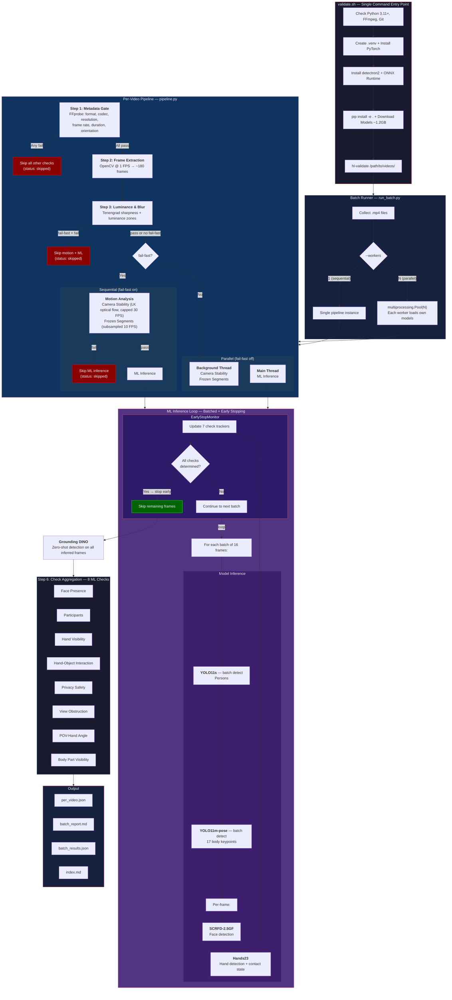

# Egocentric Video Validation Pipeline

Validates egocentric (first-person POV) video quality across 15 checks for datasets used to train autonomous humanoid robots. Runs 4 check categories: video metadata, luminance & blur, motion analysis, and ML-based detection.

## Architecture



## Quick Start

```bash
git clone <repo-url> && cd hl-bachman
./validate.sh /path/to/videos/
```

First run takes ~5-10 minutes (installs dependencies, downloads ~1.2GB of model weights). Subsequent runs start in seconds.

Setup only (no pipeline run):

```bash
./validate.sh --setup-only
```

## Requirements

- **Python 3.11+** (3.12, 3.13 also supported)
- **FFmpeg** (ffprobe used for metadata extraction)
- **~2GB disk** (model weights + virtual environment)
- **macOS** (Apple Silicon) or **Linux** (Ubuntu/Debian)
- **Windows:** Not natively supported (detectron2 lacks Windows support). Use [WSL2](https://learn.microsoft.com/en-us/windows/wsl/install) -- the pipeline runs fully inside a WSL2 Ubuntu environment.
- GPU optional -- auto-detected. Force CPU with `FORCE_CPU=1 ./validate.sh ...`

## What It Checks

See [checks.md](checks.md) for detailed acceptance conditions and thresholds.

### Video Metadata (gate -- failure skips all other checks)

| Check | Acceptance Condition |
|---|---|
| Format | MP4 container |
| Encoding | H.264 codec |
| Resolution | >= 1920 x 1080 |
| Frame Rate | >= 28 FPS |
| Duration | >= 60 seconds |
| Orientation | Rotation = 0 or 180, width > height |

### Luminance & Blur

Per-frame classification using Tenengrad sharpness + luminance zones. Video passes if both conditions are met:
1. (accept + review) frames >= 80% of total
2. Brightness stability: std dev of per-frame mean luminance <= 60

### Motion Analysis

| Check | Acceptance Condition |
|---|---|
| Camera Stability | Two-stage LK shakiness score <= 0.30 |
| Frozen Segments | No > 30 consecutive frames with SSIM > 0.99 |

### ML Detection

| Check | Model | Acceptance Condition |
|---|---|---|
| Face Presence | SCRFD-2.5GF | Face confidence < 0.8 in all frames |
| Participants | YOLO11s + SCRFD | Persons <= 1 in >= 90% frames |
| Hand Visibility | Hands23 | Both hands fully in frame (bbox > 2 px from every edge) in >= 90% frames |
| Hand-Object Interaction | Hands23 | Interaction in >= 70% frames |
| Privacy Safety | Grounding DINO | 0 sensitive objects in all frames |
| View Obstruction | OpenCV heuristics | <= 10% frames obstructed |
| POV-Hand Angle | Geometric | Hands within 40 deg of center in >= 80% frames |
| Body Part Visibility | YOLO11m-pose | Only hands/forearms (up to elbows) in >= 90% frames |

## Usage

```bash
# Single video
./validate.sh /path/to/video.mp4

# Directory of videos
./validate.sh /path/to/videos/

# Multiple files
./validate.sh video1.mp4 video2.mp4

# Custom output directory and sampling rate
./validate.sh /path/to/videos/ --output results/ --fps 2

# Skip Grounding DINO (faster, less precise privacy detection)
./validate.sh /path/to/videos/ --no-gdino

# Skip ML inference on quality-failing videos
./validate.sh /path/to/videos/ --fail-fast

# Process videos in parallel (auto-detect worker count)
./validate.sh /path/to/videos/ --workers 0

# Batch processing with all optimizations
./validate.sh /path/to/videos/ --fail-fast --workers 0
```

### Options

| Flag | Default | Description |
|---|---|---|
| `--output`, `-o` | `bachman_cortex/results` | Output directory for reports |
| `--fps` | `1.0` | Frame sampling rate (FPS) |
| `--max-frames` | unlimited | Max frames to sample per video |
| `--no-gdino` | disabled | Skip Grounding DINO (faster) |
| `--fail-fast` | off | Skip ML inference when quality checks fail |
| `--workers` | `0` (auto) | Parallel video workers (0=auto-detect, 1=sequential) |
| `--yolo-model` | `yolo11s.pt` | YOLO model for object detection |

### After Initial Setup

Once `validate.sh` has run at least once, you can also use the CLI directly:

```bash
source .venv/bin/activate
hl-validate /path/to/videos/
```

## Output

Each run creates a numbered directory (`run_001/`, `run_002/`, ...) containing:

- `batch_report.md` -- Markdown report with per-video results grouped by check category
- `batch_results.json` -- Full batch results as JSON
- `<video_name>.json` -- Per-video JSON with detailed check results

An `index.md` in the output directory tracks all runs.

### Report Format

Each check shows: status (PASS/FAIL/REVIEW/SKIPPED), acceptance condition, and actual measured result.

## Models

| Model | Purpose | Size |
|---|---|---|
| SCRFD-2.5GF | Face detection | ~14 MB |
| YOLO11s | Person + object detection | ~20 MB |
| YOLO11m-pose | Body part keypoint detection | ~40 MB |
| Hands23 | Hand detection + contact state | ~446 MB |
| Grounding DINO | Zero-shot privacy detection | ~700 MB |

Total: ~1.2 GB downloaded on first run.

## Performance

### Per-Video (180s / 1080p / 30fps, 1 FPS sampling = 180 frames)

| | GPU | CPU |
|---|---|---|
| Passing video | ~70s | ~6 min |
| Failing video (early stop) | ~70s | ~2 min |
| Failing + `--fail-fast` (luminance) | ~10s | ~12s |
| Failing + `--fail-fast` (motion) | ~70s | ~77s |

### Optimizations

The pipeline applies several optimizations automatically:

- **Early stopping:** ML inference stops when all check outcomes are mathematically determined, saving 30-70% on failing videos.
- **Batched YOLO inference:** Object detection and pose estimation process 16 frames per batch instead of one-by-one.
- **Parallel execution:** Motion analysis (I/O-bound) runs concurrently with ML inference (GPU-bound) when `--fail-fast` is off.
- **Frozen segment subsampling:** Samples at 10 FPS instead of native FPS (3-6x faster).
- **Camera stability FPS cap:** Caps optical flow analysis at 30 FPS regardless of native frame rate, so 60fps videos process at the same speed as 30fps.
- **YOLO11s default:** Uses the small YOLO variant for object detection (2x faster, sufficient for person/object detection at 1080p).
- **Hands23 downscaling:** Caps input resolution to 720p before Hands23 inference (configurable via `hands23_max_resolution`), reducing compute on the most expensive model with negligible impact on egocentric hand detection.

### Batch Processing

| Setup | Per-Video | 120 Videos |
|---|---|---|
| GPU, 2 workers | ~70s | ~70 min |
| GPU, 2 workers + fail-fast (50% fail) | ~40s avg | ~40 min |
| CPU, 4 workers | ~6 min | ~3 hrs |

Worker count auto-detects based on GPU VRAM (3 GB per worker) or CPU cores. Override with `--workers N`.

## Advanced

### Manual Setup (without validate.sh)

```bash
# 1. Create venv
python3.12 -m venv .venv && source .venv/bin/activate

# 2. Install PyTorch (CPU)
pip install torch torchvision --index-url https://download.pytorch.org/whl/cpu
# Or for CUDA:
# pip install torch torchvision --index-url https://download.pytorch.org/whl/cu121

# 3. Install ONNX Runtime
pip install onnxruntime
# Or for GPU: pip install onnxruntime-gpu

# 4. Install detectron2
pip install 'git+https://github.com/facebookresearch/detectron2.git' --no-build-isolation

# 5. Install this package
pip install -e .

# 6. Download model weights
python bachman_cortex/models/download_models.py

# 7. Run
hl-validate /path/to/videos/
```

### GPU Acceleration

`validate.sh` auto-detects NVIDIA GPUs via `nvidia-smi`. To force CPU-only:

```bash
FORCE_CPU=1 ./validate.sh /path/to/videos/
```

### Pipeline Behavior

- **Metadata gate:** If any metadata check fails, all other checks are skipped.
- **Fail-fast:** When enabled, luminance or motion failures skip ML inference entirely.
- **Early stopping:** ML inference loop stops when all check outcomes are mathematically locked in (based on pass-rate thresholds and frames processed so far). Privacy safety is excluded from early stopping so that all sensitive-object timestamps are collected.
- **Parallel execution:** Motion analysis runs in a background thread while ML inference runs on the main thread. Both read the video independently.
- **Statuses:** `pass`, `fail`, `review` (borderline), `skipped` (metadata gate or fail-fast).

## Project Structure

```
hl-bachman/
├── validate.sh                  # One-command entry point
├── pyproject.toml               # Package configuration
├── checks.md                    # Check specifications and thresholds
├── README.md
└── bachman_cortex/
    ├── pipeline.py              # ValidationPipeline orchestrator
    ├── run_batch.py             # CLI entry point (hl-validate)
    ├── checks/
    │   ├── check_results.py     # CheckResult dataclass
    │   ├── video_metadata.py    # 6 metadata checks
    │   ├── luminance_blur.py    # Tenengrad + luminance + brightness stability
    │   ├── motion_analysis.py   # Optical flow + frozen segment detection
    │   ├── face_presence.py     # Face detection check
    │   ├── participants.py      # Person count check
    │   ├── hand_visibility.py   # Hand detection check
    │   ├── hand_object_interaction.py  # Contact state check
    │   ├── privacy_safety.py    # Sensitive object detection
    │   ├── view_obstruction.py  # Lens obstruction heuristic
    │   ├── pov_hand_angle.py    # Hand angle check
    │   └── body_part_visibility.py  # Keypoint-based body part check
    ├── models/
    │   ├── download_models.py   # Model weight downloader
    │   ├── scrfd_detector.py    # SCRFD face detector
    │   ├── yolo_detector.py     # YOLO11s object detector (batch-capable)
    │   ├── yolo_pose_detector.py # YOLO11m-pose keypoint detector (batch-capable)
    │   ├── hand_detector.py     # Hands23 hand-object detector
    │   └── grounding_dino_detector.py  # Zero-shot privacy detector
    └── utils/
        ├── frame_extractor.py   # Video frame sampling
        ├── video_metadata.py    # FFprobe metadata extraction
        └── early_stop.py        # Early stopping monitor for ML checks
```
